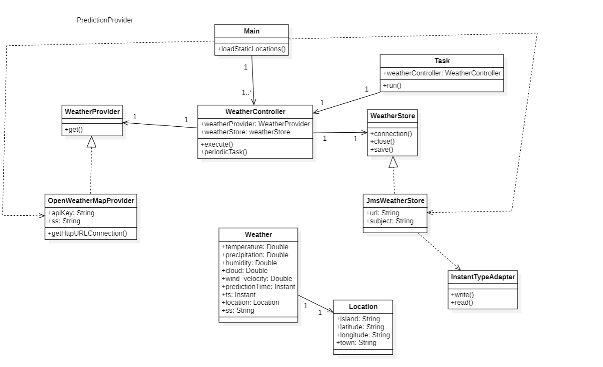
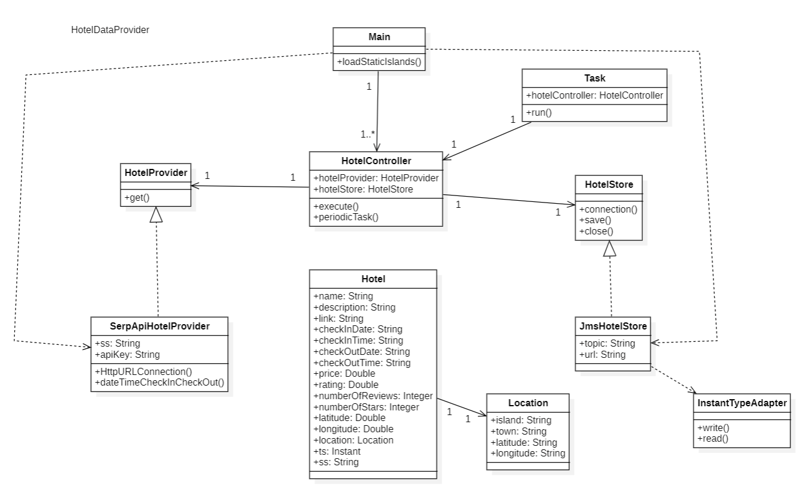
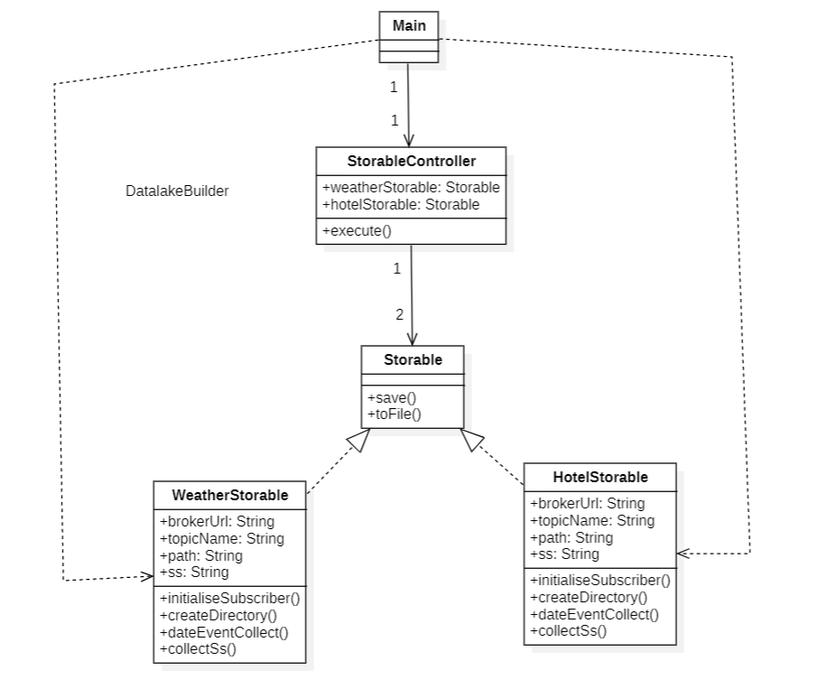
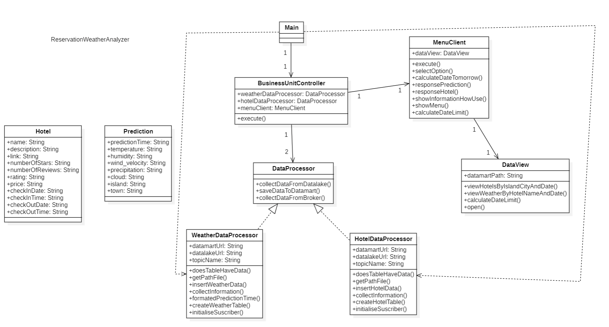

# WeatherCanaryHotelsApp

### Subject:
Data Science Application Development - Second Year
### Degree:
Data Science and Engineering
### School:
Mathematics and Informatics
### University:
Las Palmas de Gran Canaria

## Description
This project is an application that informs users of the availability 
of hotels every 4 days plus the weather forecast for those days 
on the islands of the capital municipality.

## Architecture
I use MVC pattern to develop the application, In all modules I have applied this design pattern. We use the KAPPA architecture to develop the application,
this architecture use only real time data, we don't use batch data. We only use datalake to solve the problem of the data we do not receive from the broker so as not to leave the application without service until data arrives from the broker.

## Modules
The application is divided into four modules, 
two of them in charge of collecting information on weather forecasts and another one to know the availability of hotels 
for the day after the execution and as a deadline the last prediction that is taken, after these are sent to a Broker service. 
Another module would be in charge of saving the data in a datalake to store them. Finally, the module where 
we have the data already treated to show to the users and we have the CLI interface to communicate with the clients so that they can make searches in our Business Unit that are to merge the availability data of the hotels and their positions with the weather predictions since it is a necessary factor to travel.

### PredictionProvider
This module is the one that collects the weather data from the API and sends it to the broker, 
it is divided into two parts, the first one is the one that collects the data and the second one is the one that sends it to the broker.

#### Arguments
The arguments that the module admits are the following:
- **-args[0] (String):** This argument is the one that indicates the APIkey of the API.
- **-args[1] (String):** This argument is the one that indicate the path of the file that contains the locations.

#### Structure
The structure of the module is as follows:
```
PredictionProvider
├───src
│   ├───main
│   │   ├───java
│   │   │   └───org
│   │   │       └───ulpgc
│   │   │           └───dacd
│   │   │                └─── control
│   │   │                       └─── Main.java
│   │   │                       └─── OpenWeatherMapProvider.java
│   │   │                       └─── JmsWeatherStore.java
│   │   │                       └─── WeatherStore.java
│   │   │                       └─── WeatherProvider.java
│   │   │                       └─── WeatherController.java
│   │   │                       └─── Task.java
│   │   │                       └─── InstantTypeAdapter.java
│   │   │               └───model
│   │   │                   └─── Weather.java
│   │   │                   └─── Location.java
│   │   │               └───exceptions
│   │   │                   └─── ConnectionException.java
│   │   │                   └─── URLInvalidException.java
│   │   │                   └─── JmsExceptionConnection.java
│   │   └───resources
│   │   │     └─── locations.csv
```
#### Classes Control
The classes that make up the module are the following:
- **Main:** This class is the one that starts the application, it is in charge of creating the instance of the controller and starting the application.
- **WeatherProvider:** This interface is the one that defines the methods that the provider must implement.
- **WeatherStore:** This interface is the one that defines the methods that the store must implement.
- **WeatherController:** This class is the one that controls the application, which has all the execution of this module that is made has as attributes other classes in charge of the collection of the information of the APIS and then the creation of the topic and the sending of events to the broker.
- **OpenWeatherMapProvider:** This class is the one that collects the data from the API, it is in charge of making the connection to the API.
- **JmsWeatherStore:** This class is the one that sends the events to the broker, it is in charge of creating the topic and sending the events to the broker.
- **Task:** This class controls the periodicity of the application.
- **InstantTypeAdapter:** This class is the one that converts the date to the format that the broker accepts.

#### Classes Model
The classes that make up the model are the following:
- **Weather:** This class is the one that defines the structure of the events that are going to be sent to the broker.
- **Location:** This class is the one that defines the structure of the locations that are going to be used to collect the data from the API.

#### Classes Exceptions
The classes that make up the exceptions are the following:
- **ConnectionException:** This class is the one that defines the exception that is thrown when there is a connection error.
- **URLInvalidException:** This class is the one that defines the exception that is thrown when the URL is invalid.
- **JmsExceptionConection:** This class is the one that defines the exception that is thrown when there is an error with the broker.

#### Resources
The resources that make up the module are the following:
- **locations.csv:** This file is the one that contains the locations that are going to be used to collect the data from the API.

#### Class Diagram

### HotelProvider
This module is the one that collects the hotel data from the API and sends it to the broker,
it is divided into two parts the first one is the one that collects the data and the second one is the one that sends it to the broker.

#### Arguments
The arguments that the module admits are the following:
- **-args[0] (String):** This argument is the one that indicates the APIkey of the API.
- **-args[1] (String):** This argument is the one that indicate the path of the file that contains the locations.

#### Structure
The structure of the module is as follows:
```
HotelDataProvider
├───src
│   ├───main
│   │   ├───java
│   │   │   └───org
│   │   │       └───ulpgc
│   │   │           └───dacd
│   │   │                └─── control
│   │   │                       └─── Main.java
│   │   │                       └─── SerpApiHotelProvider.java
│   │   │                       └─── JmsHotelStore.java
│   │   │                       └─── HotelStore.java
│   │   │                       └─── HotelProvider.java
│   │   │                       └─── HotelController.java
│   │   │                       └─── Task.java
│   │   │                       └─── InstantTypeAdapter.java
│   │   │               └───model
│   │   │                   └─── Hotel.java
│   │   │                   └─── Location.java
│   │   │               └───exceptions
│   │   │                   └─── ConnectionException.java
│   │   │                   └─── URLInvalidException.java
│   │   │                   └─── JmsExceptionConnection.java
│       └───resources
│           └─── locations.csv
```
#### Classes Control
The classes that make up the module are the following:
- **Main:** This class is the one that starts the application, it is in charge of creating the instance of the controller and starting the application.
- **HotelProvider:** This interface is the one that defines the methods that the provider must implement.
- **HotelStore:** This interface is the one that defines the methods that the store must implement.
- **HotelController:** This class is the one that controls the application, which has all the execution of this module that is made has as attributes other classes in charge of the collection of the information of the APIS and then the creation of the topic and the sending of events to the broker.
- **SerpApiHotelProvider:** This class is the one that collects the data from the API, it is in charge of making the connection to the API.
- **JmsHotelStore:** This class is the one that sends the events to the broker, it is in charge of creating the topic and sending the events to the broker.
- **Task:** This class controls the periodicity of the application.
- **InstantTypeAdapter:** This class is the one that converts the date to the format that the broker accepts.

#### Classes Model
The classes that make up the model are the following:
- **Hotel:** This class is the one that defines the structure of the events that are going to be sent to the broker.
- **Location:** This class is the one that defines the structure of the locations that are going to be used to collect the data from the API.

#### Classes Exceptions
The classes that make up the exceptions are the following:
- **ConnectionException:** This class is the one that defines the exception that is thrown when there is a connection error.
- **URLInvalidException:** This class is the one that defines the exception that is thrown when the URL is invalid.
- **JmsExceptionConection:** This class is the one that defines the exception that is thrown when there is an error with the broker.

#### Resources
The resources that make up the module are the following:
- **locations.csv:** This file is the one that contains the locations that are going to be used to collect the data from the API.

#### Class Diagram


### DatalakeBuilder
We have created a class to connect to the broker and save the events we receive in the folders following the paths: "datalake/eventstore/{topic}/{ss}/{YYYYYYYMMDD}.events", also indicating where we want to save the datalake.

#### Arguments
The arguments that the module admits are the following:
- **-args[0] (String):** This argument is the one that indicates the path of the file where we want to save the datalake. Example: "DatalakeBuilder/src/main/" is important the last slash.

**Important note:** This path is the second argument of the ReservationWeatherAnalyzer module is very important that the path is the same in both modules.

#### Structure
The structure of the module is as follows:
```
DataLakeBuilder
├───src
│   ├───main
│   │   ├───java
│   │   │   └───org
│   │   │       └───ulpgc
│   │   │           └───dacd
│   │   │                └─── control
│   │   │                       └─── Main.java
│   │   │                       └─── HotelStorable.java
│   │   │                       └─── Storable.java
│   │   │                       └─── StorableController.java
│   │   │                       └─── WeatherStorable.java
│   │   │               └───exceptions
│   │   │                   └─── InitialiserSubscribersException.java
```

#### Classes Control
The classes that make up the module are the following:
- **Main:** This class is the one that starts the application, it is in charge of creating the instance of the controller and starting the application.
- **Storable:** This interface is the one that defines the methods that the storable must implement.
- **HotelStorable:** This class is the one that saves the events of the hotels in the datalake.
- **WeatherStorable:** This class is the one that saves the events of the weather in the datalake.
- **StorableController:** This class is the one that controls the application, which has all the execution of this module that is made has as attributes other classes in charge of the saving of the events in the datalake.

#### Classes Exceptions
The classes that make up the exceptions are the following:
- **InitialiserSubscribersException:** This class is the one that defines the exception that is thrown when there is an error with the broker.

#### Class Diagram


### ReservationWeatherAnalyzer
This module is the one that analyses the weather and hotel data to show the users recommendations every 4 days for the next day that is done, which hotels are available to book to make a surprise trip and then with the hotel we want we look for the prediction for that hotel where it is located.
This module works with a part of logical control of all calls and searches and a part in charge of the user interface.

#### Arguments
The arguments that the module admits are the following:
- **-args[0] (String):** This argument is the one that indicates the path of the file where we want to save the datamart. Example: "ReservationWeatherAnalyzer/src/main/" is important the last slash.
- **-args[1] (String):** This argument is the one that indicates the path of the file where is the datalake. Example: "DatalakeBuilder/src/main/" is important the last slash.

**Important note:** This path is the second argument of the DatalakeBuilder module is very important that the path is the same in both modules.

#### Structure
The structure of the module is as follows:
```
ReservationWeatherAnalyzer
├───src
│   ├───main
│   │   ├───java
│   │   │   └───org
│   │   │       └───ulpgc
│   │   │           └───dacd
│   │   │                └─── control
│   │   │                       └─── Main.java
│   │   │                       └─── DataProcessor.java
│   │   │                       └─── BusinessUnitController.java
│   │   │                       └─── DataView.java
│   │   │                       └─── HotelDataProcessor.java
│   │   │                       └─── WeatherDataProcessor.java
│   │   │               └─── model
│   │   │                       └─── Hotel.java
│   │   │                       └─── Prediction.java
│   │   │               └─── exceptions
│   │   │                       └─── BrokerConnectionException.java
│   │   │                       └─── DatabaseSqliteException.java
│   │   │                       └─── MessageBrokerException.java
│   │   │                       └─── SelectException.java
│   │   │               └─── view
│   │   │                       └─── MenuClient.java
```

#### Classes Control
The classes that make up the module are the following:
- **Main:** This class is the one that starts the application, it is in charge of creating the instance of the controller and starting the application.
- **DataProcessor:** This interface is the one that defines the methods that the data processor must implement.
- **HotelDataProcessor:** This class is the one that processes the hotel data.
- **WeatherDataProcessor:** This class is the one that processes the weather data.
- **BusinessUnitController:** This class is the one that controls the application, which has all the execution of this module that is made has as attributes other classes in charge of the processing of the data and the user interface.
- **DataView:** This class is the one that executes sqlite sentences to send to the user interface.

#### Classes Model
The classes that make up the model are the following:
- **Hotel:** This class is the one that defines the structure of the events that are going to be sent to the broker.
- **Prediction:** This is the one that defines the structure of the predictions that are going to be used to collect the data from the API.

#### Classes Exceptions
The classes that make up the exceptions are the following:
- **BrokerConnectionException:** This class is the one that defines the exception that is thrown when there is an error with the broker.
- **DatabaseSqliteException:** This class is the one that defines the exception that is thrown when there is an error with the database.
- **MessageBrokerException:** This class is the one that defines the exception that is thrown when there is an error with the broker.
- **SelectException:** This class is the one that defines the exception that is thrown when there is an error with the database.

#### Classes View
The classes that make up the view are the following:
- **MenuClient:** This class is the one that shows the user interface.

#### Class Diagram


## How to use
To use the application you must follow the following steps:
1. You must run the Broker
2. You must run the datalake with the path where you want to save the datalake passing it as an argument.
3. You must run the PredictionProvider with the APIkey and the path of the file that contains the locations passing them as arguments.
4. You must run the HotelProvider with the APIkey and the path of the file that contains the locations passing them as arguments.
5. You must run the ReservationWeatherAnalyzer with the path where you want to save the datamart and the path where the datalake is passing them as arguments.

About ReservationWeatherAnalyzer you can make the following searches:
- **Search hotels by location:** You can search hotels by location, you must enter the name of the island and the name of the municipality.
The app show you the hotels that are available to book to make a surprise trip. 

It is **important** to know that the predictions based on the needs of the application and the API will only save the reservations that will be made every 4 days, that is, if data is sent on the 9th then the reservation will be made from the 10th to the 14th, from those days you will have to wait 4 days for the application to make a call to the hotels API again, this is because the API has a low number of requests that can be made and it is the easiest way to do it.

- **Search weather by hotel:** You can search weather by hotel, you must enter the name of the hotel and the app show you the weather prediction for all book days.

## Resources used
- [OpenWeatherMap](https://openweathermap.org/)
- [SerpApi](https://serpapi.com/)
- [ActiveMQ](https://activemq.apache.org/)
- [GSON](https://github.com/google/gson)
- [Maven](https://maven.apache.org/)
- [Java](https://www.java.com/es/)
- [IntelliJ IDEA](https://www.jetbrains.com/es-es/idea/)
- [Git](https://git-scm.com/)
- [GitHub](https://github.com/)
- [Markdown](https://www.markdownguide.org/)
- [JMS](https://docs.oracle.com/javaee/7/api/javax/jms/package-summary.html)
- [JDBC](https://docs.oracle.com/javase/7/docs/api/java/sql/package-summary.html)

## Author
Jorge Lorenzo Lorenzo